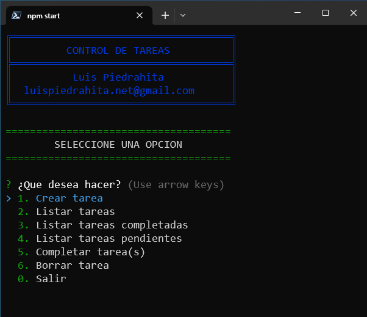

<h2 align="center">Control de Tareas</h2>

Esta es una aplicación desarrollada con NodeJS para llevar el control de tareas y que interactua con el usuario a través de la terminal 

Los datos son guardados en el archivo data.json en el disco local

Instale las dependencias y arranque la aplicación con el siguiente comando

> npm start

